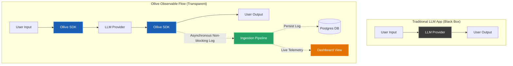
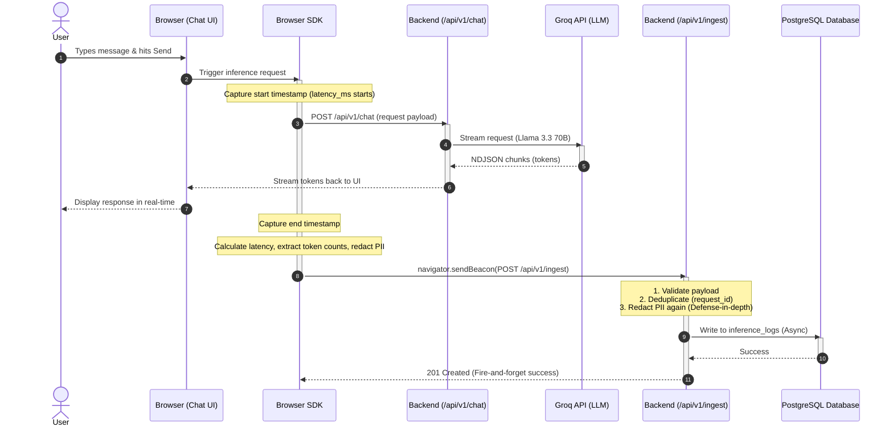
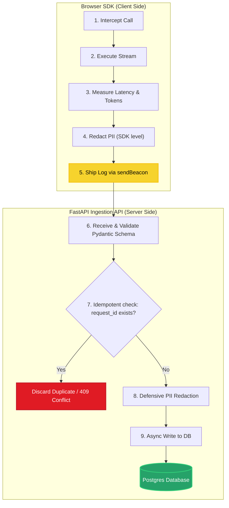
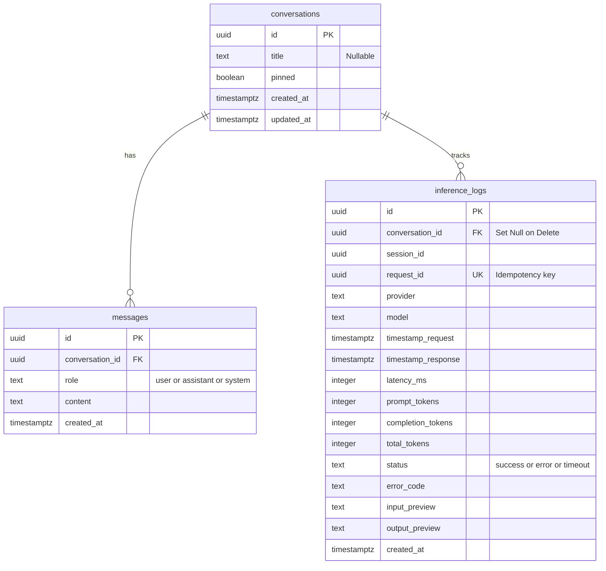

# Ollive — LLM Inference Logger

> A production-grade chatbot with an embedded inference logging SDK, real-time ingestion pipeline, and operational telemetry dashboard.

**Live demo →** [https://ollive-murex.vercel.app/](https://ollive-murex.vercel.app/)

**Architecture notes (Notion) →** [https://www.notion.so/ARCHITECTURE-36aa0469ae7880998abdccf1c3a9b2e5](https://www.notion.so/ARCHITECTURE-36aa0469ae7880998abdccf1c3a9b2e5)

---

## Table of Contents

- [Overview](#overview)
- [Architecture](#architecture)
- [Tech Stack](#tech-stack)
- [Setup](#setup)
- [Schema Design](#schema-design)
- [Tradeoffs](#tradeoffs)
- [Scaling & Failure Edge Cases](#scaling--failure-edge-cases)
- [What I'd Improve](#what-id-improve-with-more-time)
- [Bonus Task Status](#bonus-task-status)
- [Project Structure](#project-structure)

---

## Overview

Most Large Language Model (LLM) applications are black boxes. You send a prompt, get a response, and everything in between—such as latency, token costs, and errors—is lost in the dark.

**Ollive** changes this. It wraps every AI call in a lightweight SDK that tracks performance, token counts, and session information, sending it asynchronously to an ingestion pipeline.



### What We Built

| Component                  | What it does                                                                                                      | Impact                                                           |
| :------------------------- | :---------------------------------------------------------------------------------------------------------------- | :--------------------------------------------------------------- |
| 💬 **Chatbot UI**          | Clean, multi-turn interface with streaming tokens, pinned/deleted chats, and syntax-highlighted code blocks.      | Feels responsive and fast, mimicking OpenAI's ChatGPT.           |
| 🛡️ **SDK / Middleware**    | Non-blocking TypeScript logger that tracks latency, counts tokens, redacts PII, and ships logs in the background. | Runs completely in the background without slowing down the user. |
| 📥 **Ingestion API**       | A secure FastAPI endpoint that double-checks data validity, cleans out duplicates, and redacts PII.               | Serves as a defensive barrier before writing to the database.    |
| 📊 **Telemetry Dashboard** | Real-time stats showing average latency, token counts, error rates, and live recent logs.                         | Helps engineers quickly spot and debug API issues.               |

---

## Architecture

Ollive is designed around a clean separation of concerns. The user chats via the UI, while the SDK logs telemetry in a non-blocking, fire-and-forget manner.

### System Sequence Diagram

This sequence diagram illustrates the lifecycle of a user query and how logging happens out-of-band:



### Ingestion Flow Diagram

Below is the step-by-step path every log follows from the browser to the database:



### Key Design Decisions

- 🔐 **Zero API Keys in Browser:** The frontend never directly accesses the LLM API. All keys live securely on the backend.
- 🚀 **Non-Blocking Telemetry:** Logs use `navigator.sendBeacon`. This allows the browser to ship logs asynchronously even if the user closes the page, meaning telemetry never slows down the UX.
- 🛡️ **Defense-in-Depth PII Redaction:** PII redaction runs twice: once in the browser SDK (so sensitive data never traverses the wire if possible) and once on the backend (as a hard database-level guarantee).
- 🔌 **Provider-agnostic Adapter:** The `ProviderAdapter` makes adding new models (OpenAI, Anthropic, Gemini) a breeze—just drop in a new adapter file.

---

## Tech Stack

Here is the tech stack used to build the Ollive application:

| Layer            | Component / Tech           | Badge / Icon | Why We Used It                                         |
| :--------------- | :------------------------- | :----------- | :----------------------------------------------------- |
| **Frontend**     | React 19 & Vite 8          | ⚛️           | High-performance components with rapid building.       |
| **Styling**      | Tailwind CSS 3             | 🎨           | Responsive layouts using a robust token system.        |
| **State**        | Zustand 5                  | 📦           | Lightweight, reactive state management.                |
| **Markdown**     | react-markdown 10          | 📄           | Renders clean markdown formatting + Prism code blocks. |
| **Backend**      | FastAPI + Uvicorn          | ⚡           | Fast, async, type-safe API framework.                  |
| **ORM**          | SQLAlchemy 2 + asyncpg     | 🗄️           | High-throughput asynchronous database operations.      |
| **Migrations**   | Alembic                    | ⚙️           | Easy version-controlled database schema updates.       |
| **Validation**   | Pydantic v2                | 🛡️           | Type safety and execution-level data validation.       |
| **LLM Provider** | Groq (Llama 3.3 70B)       | 🤖           | Ultra-fast token generation speed (free-tier).         |
| **Database**     | PostgreSQL (Supabase)      | 🐘           | Secure, cloud-hosted relational SQL database.          |
| **Hosting**      | Vercel (FE) + Railway (BE) | ☁️           | Scalable, zero-config CI/CD hosting environments.      |
| **Containers**   | Docker & Docker Compose    | 🐳           | Standardized environment setup for local execution.    |

---

## Setup

### Prerequisites

Make sure you have [Docker](https://docs.docker.com/get-docker/) installed. (If you don't use Docker, you'll need Node.js 20+ and Python 3.12+ installed locally).

---

### Run Guide (One-Command Setup)

Imagine you are baking cookies. First, you get the ingredients, then you mix them, then you put them in the oven! Here is how to run Ollive in 4 easy steps:

#### Step 1: Copy the files to your computer (Clone the code)

Run this command in your terminal. It copies all the code from the internet into a folder on your computer.

```bash
git clone https://github.com/22-vanshika/Ollive.git && cd Ollive
```

#### Step 2: Create a secret key card (Setup environment)

Go to [console.groq.com/keys](https://console.groq.com/keys) to get a free key. Then run this command (replace `gsk_...` with your actual key):

```bash
echo "GROQ_API_KEY=gsk_..." > .env
```

_Why?_ This tells the chatbot how to connect to the brain (Groq AI).

#### Step 3: Turn on the magic box! (Start Docker)

Run this command to build and start everything:

```bash
docker compose up --build
```

_Why?_ Docker builds a virtual machine containing the Database, Backend, and Frontend. It automatically creates database tables too!

#### Step 4: Open and use it!

Open these links in your web browser:

- **Chat with the AI:** [http://localhost:5173](http://localhost:5173)
- **Watch the backend docs:** [http://localhost:8000/docs](http://localhost:8000/docs)

---

### Option B — Manual Setup (Local Development)

If you prefer to run things step-by-step without Docker, open two terminal windows:

#### 1. Backend Terminal

```bash
cd backend
python -m venv .venv
source .venv/bin/activate        # Windows: .venv\Scripts\activate
pip install -r requirements.txt

# Create your configuration file
cp ../.env.example .env
# Open '.env' and fill in DATABASE_URL and GROQ_API_KEY

alembic upgrade head             # Create database tables
uvicorn app.main:app --reload --port 8000
```

#### 2. Frontend Terminal

```bash
cd frontend
npm install
npm run dev                      # Runs website at http://localhost:5173
```

### Environment Variables

| Variable       | Required | Description                                                    | Default                     |
| :------------- | :------: | :------------------------------------------------------------- | :-------------------------- |
| `DATABASE_URL` |    ✅    | PostgreSQL connection string: `postgresql+asyncpg://...`       | -                           |
| `GROQ_API_KEY` |    ✅    | API authorization token from Groq Console                      | -                           |
| `APP_ENV`      |    ❌    | Environment status: `development` \| `staging` \| `production` | `development`               |
| `CORS_ORIGINS` |    ❌    | Allowed origins for APIs (JSON array)                          | `["http://localhost:5173"]` |
| `LOG_LEVEL`    |    ❌    | Level of server output: `DEBUG` \| `INFO` \| `WARNING`         | `INFO`                      |

---

## Schema Design

The Postgres database structure is simple, optimized, and normalized. Here is the Entity-Relationship Diagram (ERD):



### Table Details & Indexes

- **`conversations`**: Stores the meta-information of active chat sessions. `title` is generated asynchronously in the background so the user doesn't face initial setup delays.
- **`messages`**: An append-only list of turns. Indexed on `conversation_id` to make loading conversations ultra-fast.
- **`inference_logs`**: The observability table. Configured with specific indexes to optimize queries:

| Index Name                          | Column                | Target Query                | Why It's Needed                                   |
| :---------------------------------- | :-------------------- | :-------------------------- | :------------------------------------------------ |
| `ix_inference_logs_conversation_id` | `conversation_id`     | Dashboard timeline, metrics | Loads logs associated with a single conversation. |
| `ix_inference_logs_session_id`      | `session_id`          | Session replay flows        | Identifies logs belonging to one browser session. |
| `ix_inference_logs_request_id`      | `request_id` (Unique) | Ingestion check             | Prevents saving duplicate logs (idempotency key). |

---

## Tradeoffs

Designing a real-time analytics pipeline requires making deliberate structural decisions. Here are the core tradeoffs:

| Choice Made             | Alternative Considered      | Why We Chose It                                          | Tradeoff / Risk                                                               |
| :---------------------- | :-------------------------- | :------------------------------------------------------- | :---------------------------------------------------------------------------- |
| **Sync HTTP Ingest**    | Message Queue (Kafka/Redis) | Keeps infra overhead at zero. Simple deployment.         | Database connection pool could saturate under heavy write bursts.             |
| **Client-Side SDK**     | Server Proxy Interceptor    | Keeps backend completely stateless; reduces latency.     | Browser crashes could drop the final log beacon (best-effort delivery).       |
| **Groq / Llama 3.3**    | OpenAI / Anthropic APIs     | Free tier has generous limits; speeds up development.    | Tied to Groq's model ecosystem (mitigated by provider adapter).               |
| **Supabase Managed DB** | Self-hosted Postgres        | Zero operational overhead. Includes PgBouncer pooling.   | Bound to Supabase's pricing model and cloud infrastructure.                   |
| **Simulated UI Stats**  | Backend-queried UI stats    | Speeds up front-end rendering; saves database read load. | Stats shown in the chat bubbles are estimates (true stats live in dashboard). |

---

## Scaling & Failure Edge Cases

How Ollive maintains robustness and handles failures at scale:

| Failure / Scenario         | System Behavior                                               | Mitigation Strategy                                                            | V2 Future Upgrade                                                                              |
| :------------------------- | :------------------------------------------------------------ | :----------------------------------------------------------------------------- | :--------------------------------------------------------------------------------------------- |
| **Database Down**          | Ingest route fails. Transaction is rolled back by SQLAlchemy. | SDK catches the failed HTTP POST silently. User chat is unaffected.            | Send logs to local storage (IndexedDB) and retry when DB comes back.                           |
| **LLM Provider Offline**   | Proxy route raises `ProviderError` (HTTP 502 Bad Gateway).    | SDK records the failure as `status: "error"` along with the `error_code`.      | Implement automatic fallback routes to alternative providers.                                  |
| **Client Disconnected**    | `sendBeacon` fails. Browser falls back to regular `fetch()`.  | If both fail, error is caught silently. Telemetry log is discarded.            | Store failed logs in IndexedDB with exponential backoff retry.                                 |
| **Duplicate Log Delivery** | Same log is delivered twice due to browser refresh.           | Unique index on `request_id` causes a 409 Conflict. Ingest discards duplicate. | Clean up client-side retry timing.                                                             |
| **Chat Session Deleted**   | Chat is deleted while messages are streaming.                 | Frontend clears active session. Messages cascadingly delete. Log is preserved. | `inference_logs.conversation_id` is set to `NULL` (`ON DELETE SET NULL`) so telemetry is kept. |

---

## What I'd Improve With More Time

If we had more time to expand the project, we would prioritize these features:

```mermaid
gantt
    title Future Upgrades Roadmap
    dateFormat  X
    axisFormat %d
    section High Priority
    Event-based Ingestion with Redis/Kafka   :active, 0, 10
    Retry Queue with IndexedDB               :active, 0, 5
    section Medium Priority
    Real-time Dashboard with WebSockets      : 10, 20
    Streaming Abort Controller               : 5, 12
    section Analytics & Ops
    OLAP Store with TimescaleDB/ClickHouse   : 15, 30
    Self-hosted Kubernetes Manifests         : 20, 35
```



1. **Event-Based Ingestion:** Put Redis Streams or Kafka in front of the database to handle millions of logs per second without database bottlenecks.
2. **Offline Log Queue:** Save logs in the user's browser (IndexedDB) if their internet goes out, and send them when they reconnect.
3. **Real-Time WebSockets:** Update the telemetry dashboard instantly using WebSockets instead of reloading the page.
4. **Streaming Cancel Button:** Let the user stop the AI mid-sentence using an `AbortController`.
5. **Multi-User Security:** Add User Login using Supabase Auth (JWT) so multiple people can use the app separately.
6. **Analytics Database:** Move telemetry logs to ClickHouse or TimescaleDB so charts remain fast even with billions of rows.
7. **Production Kubernetes:** Add Helm charts and Kubernetes manifests to auto-scale the backend on AWS, GCP, or Azure.

---

## Bonus Task Status

### ✅ Completed Tasks (8 / 10)

- **Multi-Provider Support:** Plug-and-play adapter system makes adding providers simple.
- **Streaming Responses:** Smooth, token-by-token text generation.
- **Observability Dashboards:** Interactive charts for latency, error rate limits, and tokens.
- **Double PII Redaction:** Client-side + server-side regex scrubbers remove credit cards, emails, and SSNs.
- **Docker Compose Setup:** One-command startup wrapper script.
- **Sidebar History:** Lists, pins, and manages user chat histories.
- **Resume Chat:** Loads past conversations dynamically.
- **Observability Preservation:** Deleting conversations does not purge database telemetry.

### ❌ Remaining Tasks (2 / 10)

- **Event-Based Ingestion Queue:** Estimated Effort: _1-2 Days_. Needs Redis/Kafka integration.
- **Self-Hosted Kubernetes:** Estimated Effort: _1 Day_. Requires writing deployment/ingress manifests.

---

## Project Structure

This overview details where everything lives in the Ollive project repository:

```
ollive/
├── docker-compose.yml     # Magic file that runs everything in one go
├── .env.example           # Template for environment settings
│
├── backend/               # FastAPI Backend Service
│   ├── Dockerfile
│   ├── requirements.txt
│   └── app/
│       ├── api/v1/        # API Routes (chat proxy, CRUD chats, metrics, ingest)
│       ├── core/          # Backend configuration and database startup
│       ├── models/        # Database table blueprints (SQLAlchemy models)
│       ├── repositories/  # Database read/write queries
│       ├── schemas/       # Data validation blueprints (Pydantic models)
│       └── services/      # Core logic (PII scrubbing, Chat streaming rules)
│
├── frontend/              # React Frontend Website
│   ├── Dockerfile
│   ├── nginx.conf
│   └── src/
│       ├── components/    # Reusable parts (chat bubbles, dashboard cards)
│       ├── sdk/           # Inference tracking, PII redaction code, adapters
│       ├── pages/         # Chatpage view & Dashboard page view
│       └── store/         # Zustand global state management
│
└── migrations/            # Database evolution blueprints (Alembic history)
```
